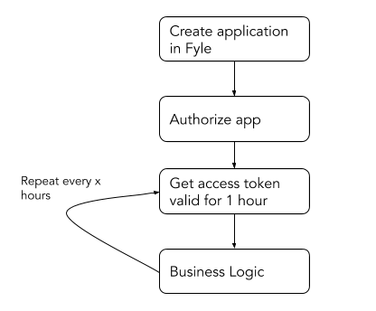
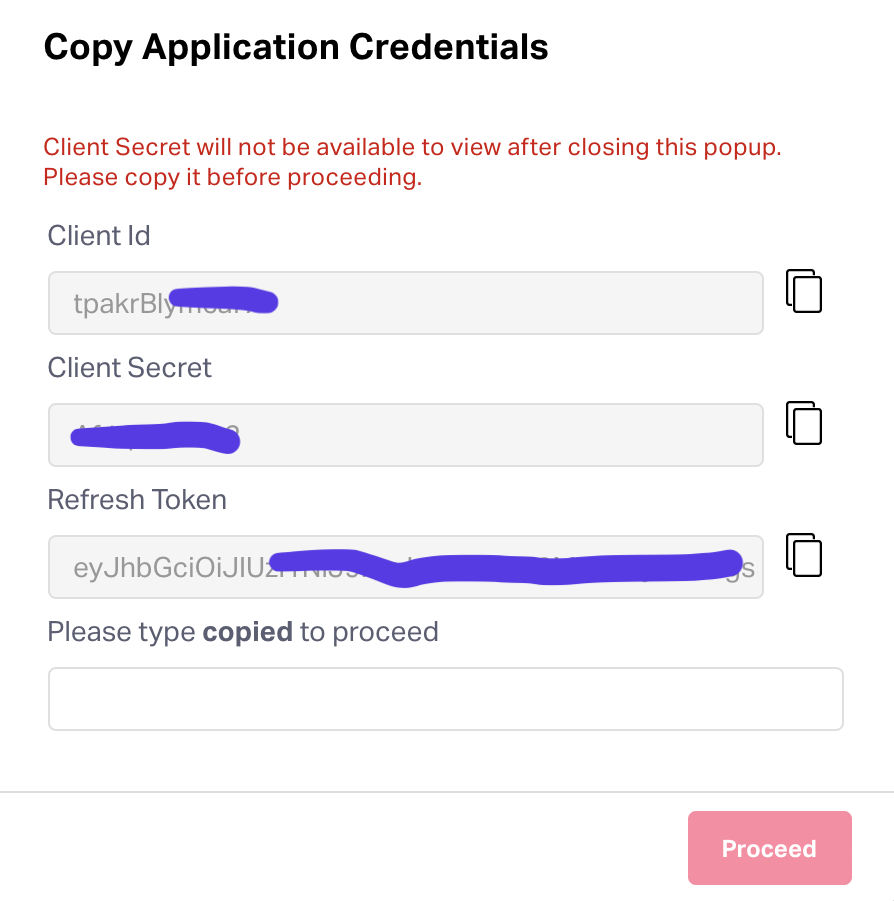
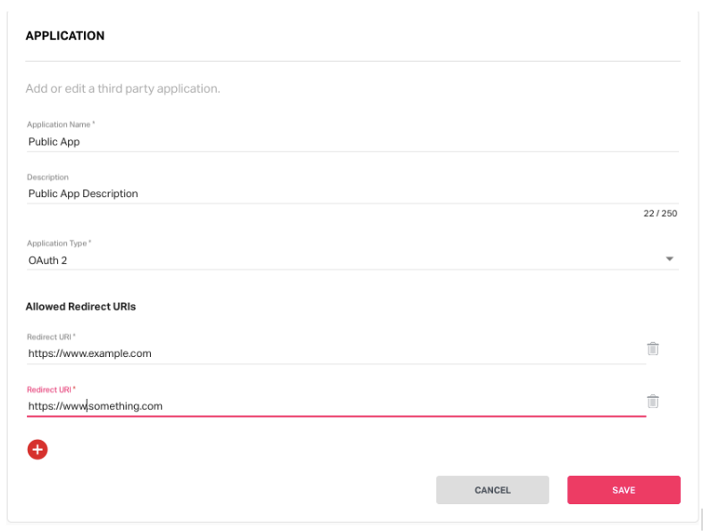

# Application

An application, in this context, is any piece of code that will interact with Fyle APIs. You'll first need to create an application in Fyle by visiting the developer page. 

<!-- theme: warning -->

> #### 💡 Currently, only admins can create applications
>
>  We expect this restriction to be removed very soon. Stay tuned. If this makes you angry, send us a note at platform-beta@fylehq.com

There are two kinds of applications you can build. The primary difference between them is how you can authorize the application to access your data.

Internal: These are private to you and will not be used by any others. You don’t need to build OAuth flow - you can simply use some critical information and attach them along with every request.

OAuth 2: These are generally multi-tenant integrations and you expect multiple distinct organizations to use it. If you are interested in building an OAuth application, do send us a note at platform-beta@fylehq.com. Here is an interesting blog to enhance your understanding of OAuth https://stories.fylehq.com/posts/the-non-boring-guide-to-oauth-2-0

Subsequent to authorization, the rest of the steps for the application are similar.

Never share your client secret or refresh token with anyone - this can be used to access your entire organization’s data.

## Creating an Application

Login to Fyle by going to https://accounts.fylehq.com and entering your credentials. Then navigate to Settings on the top-right corner.

On the left sidebar, you will see "Integrations". Click on "Custom Apps" below that.

<!--
focus: false
-->

In the "Custom Apps" page, you will have the option to create a new app.

Give your application a friendly name and a nice description and not "test test". When picking the application type,
you'll need to decide if you want to create an internal application or an OAuth 2.0 application. Specific documentation
for each type is below.

## Internal Application

These applications are to be used only by the specific user / organization and is generally highly customised. In the next screen, you'll be asked to save some credentials - they won't be shown again.

<!--
focus: false
-->

Specifically, you'll need three pieces of information:
1. Client id
2. Client secret
3. Refresh token

With these pieces of information, your app can use the OAuth 2.0 token API to get a new access token. Your app should also figure out the data cluster endpoint. Now your app is ready to make calls to read / write data.

## OAuth 2.0 Application

These applications are for public use by multiple organizations. Usually when building integrations that can be used by any Fyle user irrespective of the organization. 

<!--
focus: false
-->

You can provide us with all the redirect URIs that you want Fyle to allow in OAuth 2. After clicking on ‘save’ you will be able to copy the Client Id, Client Secret.

Next, we'll talk about how to [authorize the application](../concepts/authorization.md).