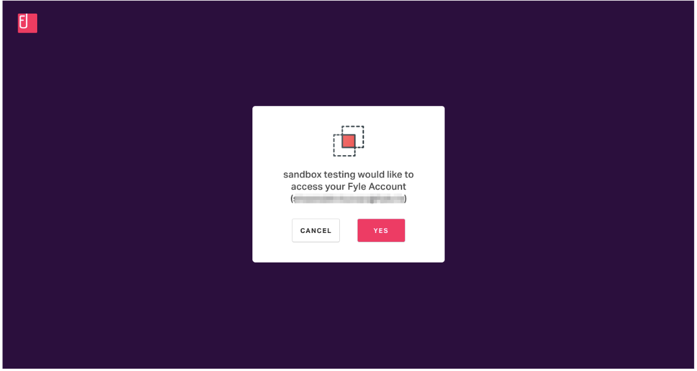

# Authorization

## Internal app

For internal apps, you will get the refresh token, client id and client secret when creating the application. You can get the access token using an HTTP POST to the token URL. This returns a new access token.

POST https://accounts.fylehq.com/api/oauth/token

The body will have the following data:

* grant_type should be the literal string 'refresh_token'
* refresh_token
* client_id = <Your Client Id>
* client_secret = <Your Client Secret>

This will return the access token which has to be attached to the header of every API call.

The access token is valid for one hour. Every subsequent request should have an Authorization header with the access token. See the API reference for more details.

The client is responsible for getting a new access token when it expires.

## OAuth 2.0 application

While building a public application that you will share with many users, you'll need to direct your users to the authorize URL https://accounts.fylehq.com/app/developers/#/oauth/authorize

The query parameters that need to be sent along with this URL are:

* client_id = <Your Client Id>
* response_type = <Your Response Type> (eg.- code, token)
* redirect_uri = <Your Redirect URI>
* State = <Current State of your Application>

The authorizing user will be sent to a page like this:

Once the user clicks yes, they will be redirected to the redirect URL registered by the client application during creation with the code.

Rest of the steps are standard OAuth flows. We currently support the code flow. We plan on supporting PKCE shortly.