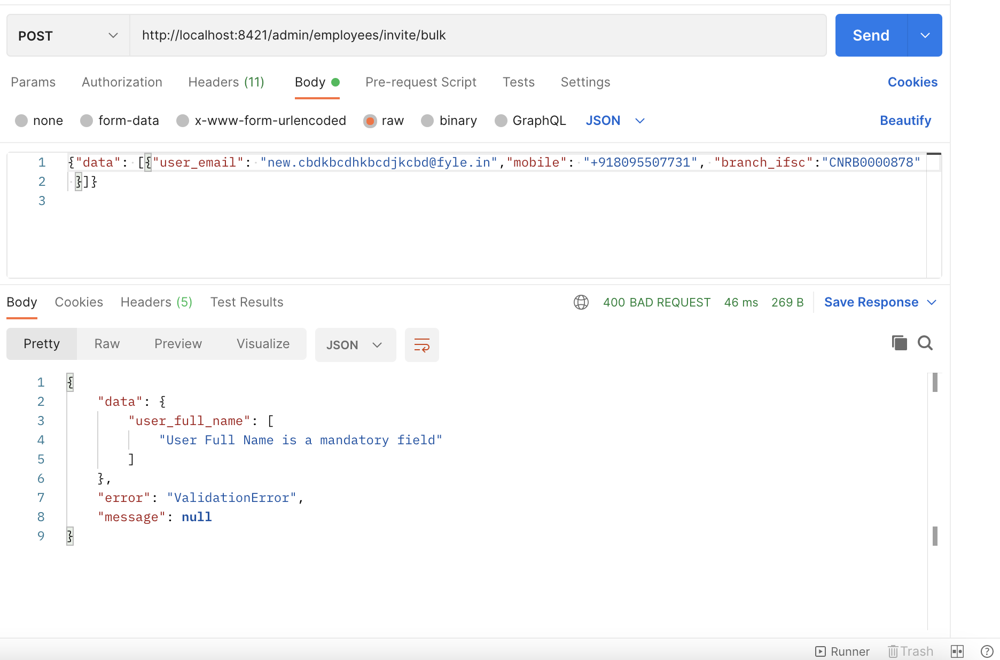
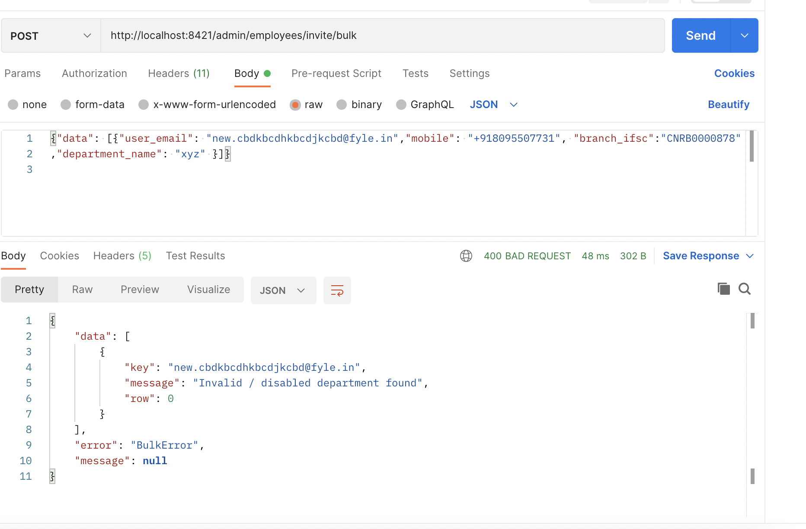
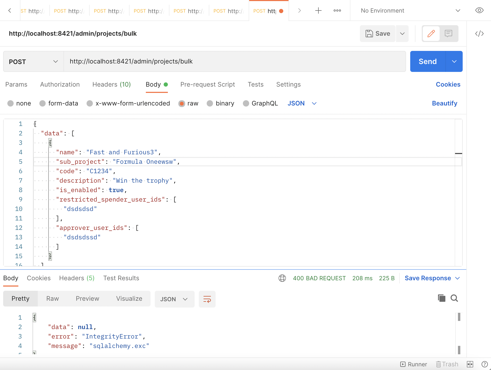

# Errors
Fyle uses conventional HTTP response codes to indicate the success or failure of an API request. 
In general: 
*   Codes in the 2xx range indicate success. 
*   Codes in the 4xx range indicate an error that failed given the information provided (e.g., a required parameter is missing, improper usage of parameters etc.). 
*   Codes in the 5xx range indicate an error with Fyle's servers(these are rare). 

> Please contact us at support@fylehq.com if a 5xx error is encountered. 

## Types Of Errors
| SL NO.  |  HTTP STATUS CODE  | HTTP MESSAGE | ENGLISH EXPALINATION |
|---------|--------------------|--------------|--------------------- |
|    1.   |         400       |   Bad Request |  The request data or query sent is malformed |
|     2.   |         401      |  Unauthorized |  The token is either not given Fyle or is timed out |
|    3.   |          403      |     Forbidden |  The API token doesn't have permissions to perform the requested action|
|     4.    |          404     |      Not Found  |  We dont understand request

## Differnet Reasons for 400 error 

1. **ValidationError:** 
    This type error occurs when either a parameter with is mandatory is missing or when the parameters that are not formated as defined (Eg: Passing a interger for a string , Not following pattern required for phone numbers etc.)
    <!--focus: false-->
    ||
    |:--:|
    | <b>Example of ValidationError. Required parameter user_full_name is missing</b>    
2. **BulkError:**
    This type error occurs when you are doing a bulk operations. Generally this error occurs when you pass a value for an entity parameter for which that particular entity is not found. (Eg: Passing an unkonwn department name which does not exists etc.). 
     <!--focus: false-->
    ||
    |:--:|
    | <b>Example of BulkError. Department named XYZ does not exists in the org</b> 
3. **IntegrityError:**
    This error is encountered when an sql contraints fails. (Eg: Creating an project with same project name , sub project name inside the same org, passing user_id for which the users dont exists).
    <!--focus: false-->
    ||
    |:--:|
    | <b>Example of IntegrityError. User is trying to create a project with same values. Hene unqiue constraint failed</b> 

## Attributes Of Error Repsonse: 

The images above show that all the three types of error have three attributes:
1. data 
2. error 
3. message

**Data Attribute:**
    The <u>data</u> attribute will consits of usefull information pertaining to errors in the parameter sent. 
1. When a *ValidationError* is encountred, the response data attribute will consists the information about the which key is causing the error and for what reason. Examples
    1. [Example of missing param](../../assets/images/concepts/errors/ValidationError2.png)
    2. [Example of malformed param](../../assets/images/concepts/errors/ValidationError1.png)
2. When a *BulkError* is encountred, the response data is an array of object which consists of the following keys: 
    1. *key* refers to the value that uniquley the identify the object from the array of objects that is passed as parameter.
    2. *message* gives reason for failure of message
    3. *row* indicates the index of the object in the data array that is passed by the user.
    Example: [Example of Bulk Error](../../assets/images/concepts/errors/bulkError.png)
**Error Attribute:**
    The <u>error</u> attribute will specify the type error that has occured. 
**message**
    The <u>message</u> attribute will have human readable explaination of about why the request is failing. 
    
