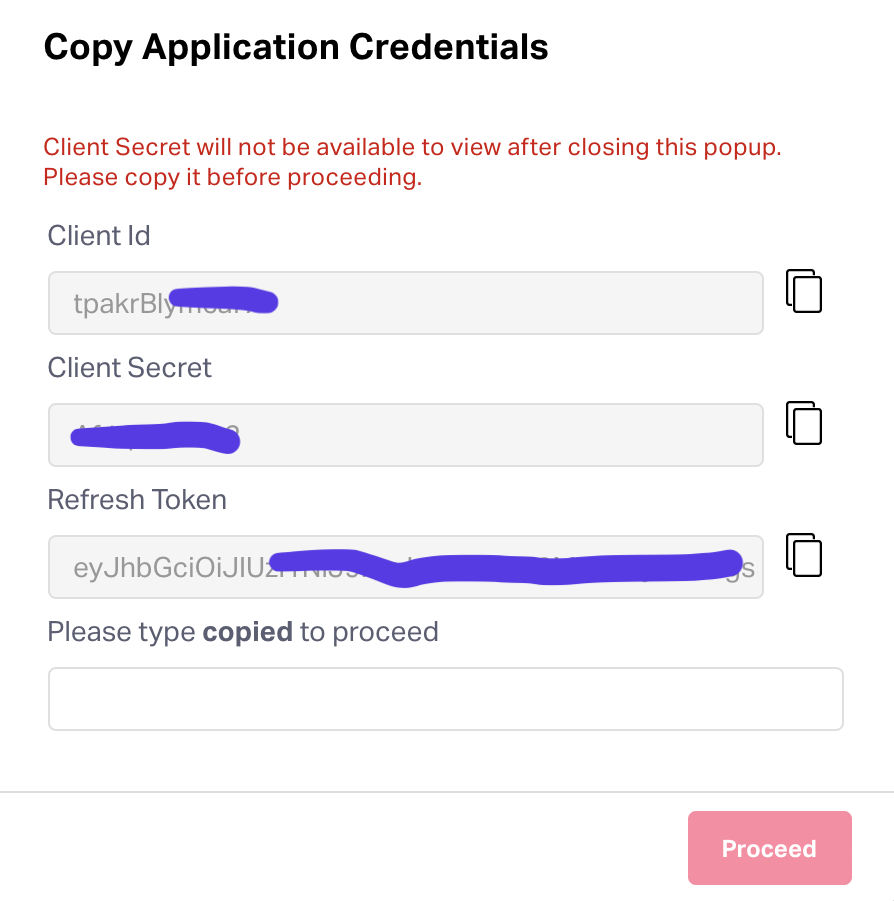

# Internal Application

An internal application is one that will be used by a specific user or organization only. This is the most common type of application that will be built by Sage Exp Mgmt customers. If you are a Sage Exp Mgmt partner, you will likely want to check out [OAuth 2.0 applications](./oauth2-application.md).

> #### Currently, only admins can create applications
>
>  We expect this restriction to be removed very soon. Stay tuned. If this makes you angry, send us a note at support@fylehq.com

Login to Sage Exp Mgmt by going to https://app.fylehq.com and entering your credentials. Then navigate to Settings on the top-right corner.

On the left sidebar, you will see "Integrations". Click on "Custom Apps" below that.

<!--
focus: false
-->

In the "Custom Apps" page, you will have the option to create a new app.

Give your application a friendly name and a nice description and not "test test". Pick "Internal" as the application type.

<!--
focus: false
-->

Copy over the these three critical pieces of information:
1. client_id
2. client_secret
3. refresh_token

Client secret and refresh token should be treated as confidential - don't post it on your twitter profile.

To get an access token, you need to POST to the [token API](https://docs.fylehq.com/docs/fyle-platform-docs/b3A6MTIyMzMxODU-o-auth-2-0-token) with `grant_type` as `refresh_token`. The access token is valid for 1 hour.

As the next step, you need to figure out the [cluster endpoint](./cluster.md). Once you have the access token and cluster endpoint, go over the short [guide to data APIs](./guide-data-apis.md).
