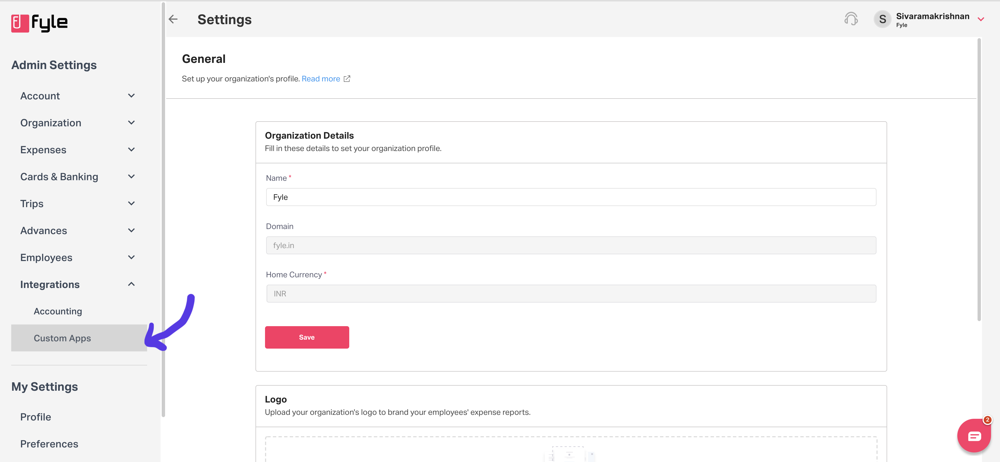

# OAuth 2.0 Application

This type of application is generally built by partners and are used by multiple organizations. Here is a non-boring blog that explains OAuth 2.0 in detail https://stories.fylehq.com/p/the-non-boring-guide-to-oauth-20

> #### 💡 Talk to us if you're interested in a partnership
>
> If you're considering building an OAuth 2.0 application, do send us a note at support@fylehq.com. We'd love to understand your use-case and explore potential for partnership.

Login to Sage Exp Mgmt by going to https://app.fylehq.com and entering your credentials. Then navigate to Settings on the top-right corner.

On the left sidebar, you will see "Integrations". Click on "Custom Apps" below that.

> #### Currently, only admins can create applications
>
>  We expect this restriction to be removed very soon. Stay tuned. If this makes you angry, send us a note at support@fylehq.com

<!--
focus: false
-->

In the "Custom Apps" page, you will have the option to create a new app.

Give your application a friendly name and a nice description and not "test test". Pick "OAuth 2.0" as the application type.

You can add the redirect URIs that you want to allow in the OAuth 2.0 flows. After clicking on ‘save’ you will be able to copy the following pieces of information:

* client_id
* client_secret

We currently support the "Authorization Code" flow and "Refresh Token Flow" of OAuth 2.0. If you want a primer on these flows, head to this great [blogpost](https://darutk.medium.com/diagrams-and-movies-of-all-the-oauth-2-0-flows-194f3c3ade85), but come back soon! We plan on adding support for PKCE Authorization request in the near future.

To authorize the app:
* use the following URL: `https://app.fylehq.com/app/developers/oauth/authorize?client_id=<client_id>&redirect_uri=<redirect_uri>`
* replace the `<client_id>` with your `client_id`
* replace the `<redirect_uri>` with your redirect URI
  * if no redirect URI is setup for your app, you may remove the following from the above URL `&redirect_uri=<redirect_uri>`

When a user authorizes the app, they will be redirected to the redirect URI above with the `code` and `state` parameter. At this point, your web application will need to pass this to your server which stores the `client_id` and `client_secret`.

Your backend server will have to make an OAuth 2.0 token call ([API reference](https://docs.fylehq.com/docs/fyle-platform-docs/b3A6MTIyMzMxODU-o-auth-2-0-token)) and send in the code. You will receive the following two pieces of information back:

* refresh_token - which is valid for a year
* access_token - which is valid for 1 hour

You can store the refresh_token in the backend as you might need it again later.

Once the access token expires, you'll need to get a new access token. You need to POST to the [token endpoint](https://docs.fylehq.com/docs/fyle-platform-docs/b3A6MTIyMzMxODU-o-auth-2-0-token) with `grant_type` as `refresh_token`. The access token is valid for 1 hour.

As the next step, you need to figure out the [cluster endpoint](./cluster.md). Once you have the access token and cluster endpoint, go over the short [guide to data APIs](./guide-data-apis.md).

