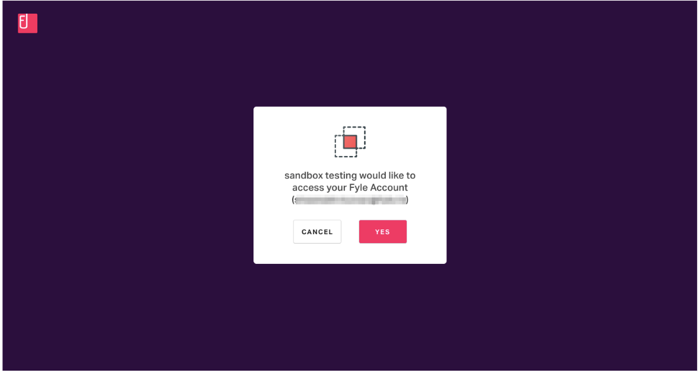

# OAuth 2.0 Application

This type of application is generally built by partners and are used by multiple organizations. Here is a non-boring blog that explains OAuth 2.0 in detail https://stories.fylehq.com/posts/the-non-boring-guide-to-oauth-2-0

> #### 💡 Talk to us if you're interested in a partnership
>
> If you're considering building an OAuth 2.0 application, do send us a note at platform-beta@fylehq.com. We'd love to understand your use-case and explore potential for partnership.

<!-- theme: warning -->

> #### 💡 Currently, only admins can create applications
>
>  We expect this restriction to be removed very soon. Stay tuned. If this makes you angry, send us a note at platform-beta@fylehq.com

Login to Fyle by going to https://accounts.fylehq.com and entering your credentials. Then navigate to Settings on the top-right corner.

On the left sidebar, you will see "Integrations". Click on "Custom Apps" below that.

<!--
focus: false
-->

In the "Custom Apps" page, you will have the option to create a new app.

Give your application a friendly name and a nice description and not "test test". Pick "OAuth 2.0" as the application type.

You can add the redirect URIs that you want to allow in the OAuth 2.0 flows. After clicking on ‘save’ you will be able to copy the following pieces of information:

* client_id
* client_secret

Next, we'll talk about how to [authorize the application](../concepts/authorization.md).

# Authorization

Authorization typically involves two steps:

1. Getting a refresh token - this represents the fact that a end-user has authorized this piece of code to act on their behalf. The refresh token is long-lived ~1 yr
2. Using the refresh token, the application should get an access token which is short-lived (~1 hr). All data operation API calls should only include the access token

Step 1 differs based on whether your app is an internal app or an OAuth 2.0 app. Step 2 is identical for both types of apps.

## Internal app

For internal apps, you will get the refresh token, client id and client secret when creating the application. You can get the access token using an HTTP POST to the token URL. This returns a new access token.

POST https://accounts.fylehq.com/api/oauth/token

The body will have the following data:

* grant_type should be the literal string 'refresh_token'
* refresh_token
* client_id
* client_secret

This will return the access token which has to be attached to the header of every API call.

The access token is valid for one hour. Every subsequent request should have an Authorization header with the access token. 

The client is responsible for getting a new access token when it expires.

## OAuth 2.0 application

While building a public application that you will share with many users, you'll need to direct your users to the authorize URL https://accounts.fylehq.com/app/developers/#/oauth/authorize

The query parameters that need to be sent along with this URL are:

* client_id
* response_type (code, token)
* redirect_uri
* state

The authorizing user will be sent to a page like this:

<!--
focus: false
-->

Once the user clicks yes, they will be redirected to the redirect URL registered by the client application during creation with the code.

Rest of the steps are standard OAuth flows. We currently support the code flow. We plan on supporting PKCE shortly.

At this point, you should have a refresh token and access token.

Note that your access token is valid for one hour. Every subsequent request should have an Authorization header with the access token. 

The client is responsible for getting a new access token when it expires.

The next step is to figure out which [cluster](../concepts/cluster.md) contains data so that you can hit the right API endpoints.