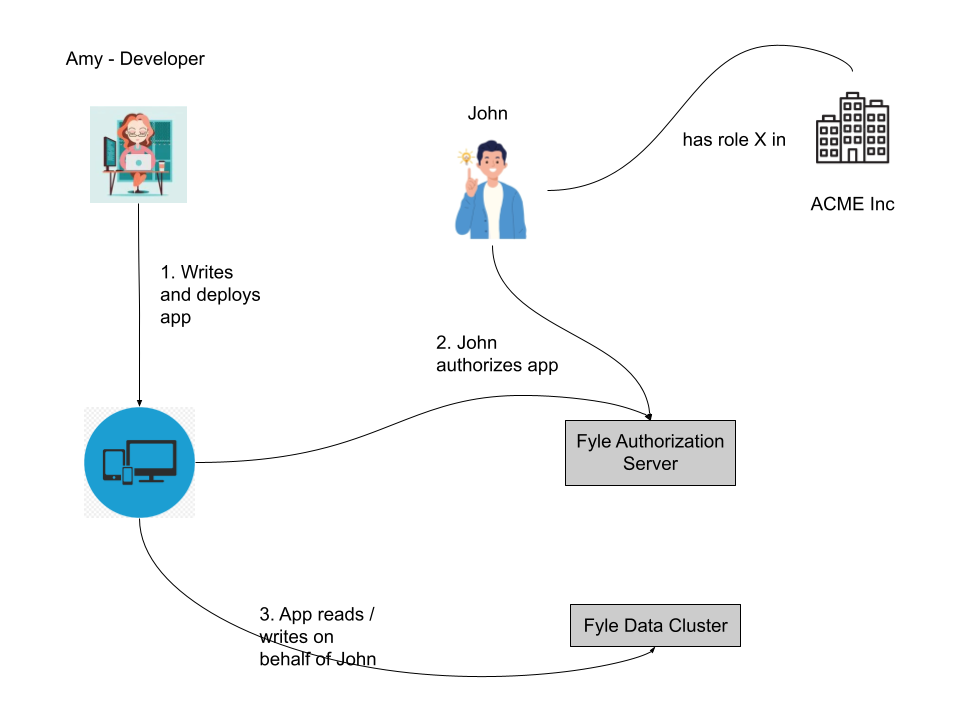

# Introduction

[Fyle](https://www.fylehq.com) is an expense management SaaS product. If you don't have a Fyle account, please visit our [website](https://www.fylehq.com).

If you're looking to build applications that interface with Fyle, then you're in the right place.

Let's face it. Most API docs are super-boring and have words like Authorization, REST APIs and resources and all that.

We strive to make it a little more fun and accessible.

Let's set the stage first. We have two characters, John and Amy.

* John is a Fyle user. He has a Fyle login. 
* John is part of one or more organizations, let's call it Acme Inc. Most users are only part of one organization, btw.
* John plays one or more roles in the organization. John may be an admin, but not a spender. John may be a spender and an approver. You get the picture.
* John wants to access his Fyle data (e.g. expenses) and do something with it. Maybe create a CSV or push the data to another system
* John asks Amy who is a coding ninja warrior for help

If you're reading this, you're likely an Amy. Amy can whip up some frontend or backend code in a jiffy. She talks to John and understands his requirements. She whips up a cool application in Python or something.

* Amy needs to have a Fyle account. If she doesn't, she can be invited to join Fyle by an admin (this could be John or someone else)
* She needs to create an application by going to Fyle's developer page and get some magical information
* She will deploy her application somewhere and provide a link to John
* When John tries to access this app, he will be redirected to Fyle's account server where he will have to establish his identity (i.e. prove that he is, indeed, John) and then he will have to grant the app rights to act on his behalf. The app performs the holy OAuth 2.0 dance with the Authorization server and gets some magic tokens
* The app figures out which Data Cluster hosts John's data

Now, the app starts doing real work. It makes REST API calls to the right Data Cluster and pulls out John's data using the right APIs with the magic tokens and maybe even writes some data back. 

<!--
focus: false
-->

That's a very high-level summary of how to use Fyle's APIs. The devil, as always, is in the details. 

Next, you'd want to understand the [Types of Applications](./concepts/types-of-application.md) in Fyle and how to get them to work for you. 
